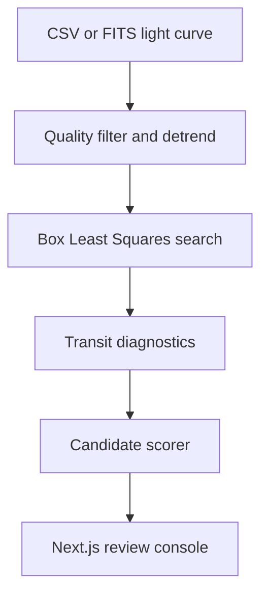

# System architecture

The project separates mission-data ingestion, deterministic transit search,
machine-learning classification, and operator review. The baseline remains
usable without a neural checkpoint, while the same API can load a validated
TorchScript model for learned scoring.

## Runtime components

| Component | Location | Responsibility |
|---|---|---|
| Analysis console | `apps/web` | Upload, charts, candidate ranking, and diagnostic review |
| HTTP service | `apps/api/app/main.py` | Input limits, inference lifecycle, and typed responses |
| Ingestion | `apps/api/app/services/pipeline.py` | CSV/FITS parsing and mission metadata |
| Preprocessing | `apps/api/app/services/pipeline.py` | Quality masks, robust clipping, normalization, and detrending |
| Transit search | `apps/api/app/services/pipeline.py` | Box Least Squares periodogram and phase folding |
| Candidate scorer | `apps/api/app/services/scoring.py` | Neural checkpoint or transparent baseline |
| Neural model | `ml/model.py` | Residual 1D morphology encoder and diagnostic fusion |
| Training data | `ml/dataset.py` | Real NPZ samples or synthetic transit injection |
| Trainer | `ml/train.py` | Optimization, validation metrics, checkpoints, and export |

## Detection sequence

1. Validate the upload and decode time, flux, uncertainty, and quality arrays.
2. Remove invalid or flagged cadences and sort observations chronologically.
3. Normalize flux, reject extreme outliers, and estimate a long-timescale trend.
4. Search a duration grid with Box Least Squares.
5. Measure the best event's depth, duration, S/N, period, and transit count.
6. Compare odd and even events and inspect the expected secondary-eclipse phase.
7. Phase fold the signal and compute a candidate probability.
8. Return downsampled chart data and explicit vetting flags to the console.

## Inference modes

- **Baseline:** a documented logistic score based on transit S/N, event count,
  duration ratio, odd-even consistency, and secondary depth.
- **Learned:** a TorchScript `TransitFusionNet` combines a 256-bin
  phase-folded morphology window with eight normalized diagnostics.

Every response declares its mode. A baseline score is never presented as a
trained model result.

## Deployment boundaries

The service is stateless and does not require an external API at inference
time. MAST or Lightkurve can be used during dataset acquisition, but uploaded
curves are analyzed locally. Containers run as unprivileged users, upload size
is bounded, and accepted extensions are allow-listed.
